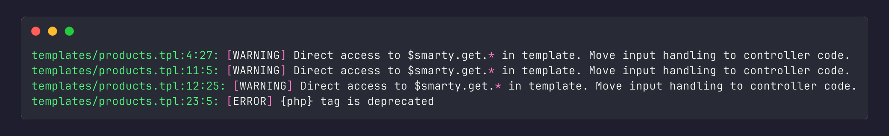
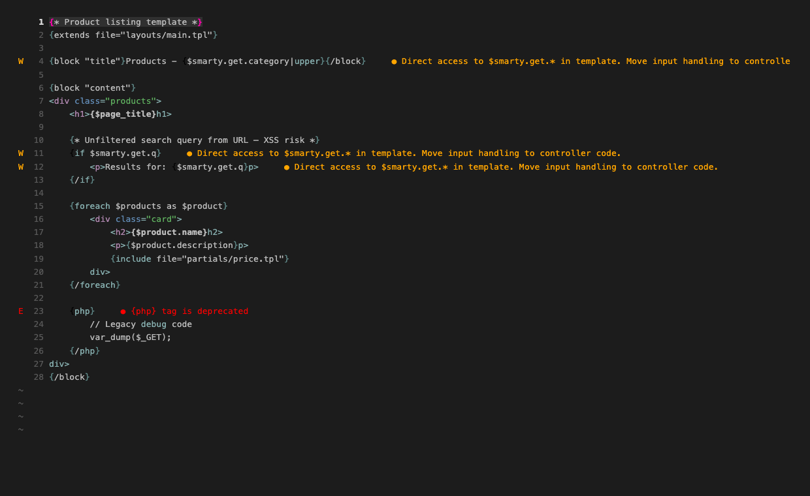

# SmartyLint

A CLI linter for [Smarty](https://www.smarty.net/) templates, powered by [SmartyAST](https://github.com/3n9/smarty-ast).

Parses each template into a typed AST and runs configurable walker-based rules. Supports project-wide analysis for unused code.



---

## Requirements

- PHP 8.4+
- Composer *(only required for source / Composer installs)*

---

## Installation

### PHAR *(recommended)*

Download the latest pre-built binary from [GitHub Releases](https://github.com/3n9/SmartyLint/releases/latest):

```bash
curl -L https://github.com/3n9/SmartyLint/releases/latest/download/smartylint.phar \
     -o smartylint.phar
chmod +x smartylint.phar
sudo mv smartylint.phar /usr/local/bin/smartylint
```

Verify the install:

```bash
smartylint --version
```

### Via Composer

```bash
composer require 3n9/smarty-lint
vendor/bin/smarty-lint --version
```

### From source

```bash
git clone https://github.com/3n9/SmartyLint.git
cd SmartyLint
composer install
php bin/smarty-lint --version
```

---

## Usage

```
php bin/smarty-lint [options] <file|dir> [...]
```

### Options

| Flag | Description |
|------|-------------|
| `--recursive`, `-r` | Recursively scan directory for `.tpl` files (unreadable subdirectories are skipped) |
| `--format <fmt>` | Output format: `text` (default), `json`, `sarif`, `checkstyle` |
| `--json` | Alias for `--format json` |
| `--find-unused` | Run project-wide unused-code analysis after per-file linting |
| `--errors-only` | Suppress warnings; only report `ERROR` severity issues |
| `--exclude <pattern>` | Exclude files matching a glob pattern (repeatable) |
| `--template-root <path>` | Base directory for resolving `{include}` / `{extends}` paths |
| `--max-depth <n>` | Maximum recursion depth for `--recursive` directory scans (`0` = root directory only) |
| `--enable <rule>` | Enable an opt-in rule (repeatable), e.g. `--enable UnescapedVariable` |
| `--version`, `-V` | Print version and exit |

### Exit codes

| Code | Meaning |
|------|---------|
| `0` | No issues found (or all suppressed by `--errors-only`) |
| `1` | Issues found, or a fatal error occurred |

### Examples

Lint a single file:
```bash
php bin/smarty-lint templates/page.tpl
```

Lint an entire directory:
```bash
php bin/smarty-lint --recursive templates/
```

JSON output (for CI/editor integration):
```bash
php bin/smarty-lint --json --recursive templates/
```

SARIF output (GitHub Actions / VS Code):
```bash
php bin/smarty-lint --format sarif --recursive templates/ > results.sarif
```

Checkstyle XML output (Jenkins / PHPStorm):
```bash
php bin/smarty-lint --format checkstyle --recursive templates/
```

Errors only (fail fast, no warnings):
```bash
php bin/smarty-lint --errors-only --recursive templates/
```

Exclude generated or vendor templates:
```bash
php bin/smarty-lint --recursive --exclude '*/vendor/*' --exclude '*/generated/*' templates/
```

Resolve includes relative to a shared template root:
```bash
php bin/smarty-lint --template-root /var/www/app/templates --recursive templates/
```

Project-wide unused code analysis:
```bash
php bin/smarty-lint --find-unused --recursive templates/
```

---

## Editor Integration

### Neovim — nvim-lint (LazyVim)



Create `lua/plugins/lint.lua` in your Neovim config:

```lua
return {
  {
    "mfussenegger/nvim-lint",
    opts = function(_, opts)
      -- Register the smartylint linter
      local lint = require("lint")
      lint.linters.smartylint = {
        name = "smartylint",
        cmd = "smartylint",
        args = { "--json" },
        stdin = false,
        append_fname = true,
        stream = "stdout",
        ignore_exitcode = true,
        parser = function(output)
          local issues = vim.json.decode(output) or {}
          local diagnostics = {}
          for _, issue in ipairs(issues) do
            table.insert(diagnostics, {
              lnum     = issue.line - 1,
              col      = issue.col - 1,
              message  = issue.message,
              severity = issue.severity == "ERROR"
                and vim.diagnostic.severity.ERROR
                or  vim.diagnostic.severity.WARN,
              source   = "smartylint",
            })
          end
          return diagnostics
        end,
      }

      -- Attach to Smarty files
      opts.linters_by_ft = opts.linters_by_ft or {}
      opts.linters_by_ft.smarty = { "smartylint" }
    end,
  },
}
```

Neovim doesn't have a built-in `smarty` filetype. Add this to detect `.tpl` files:

```lua
vim.filetype.add({ extension = { tpl = "smarty" } })
```

---

### Visual Studio Code — diagnostic-languageserver

Install the [diagnostic-languageserver](https://marketplace.visualstudio.com/items?itemName=lgbtm.diagnostic-language-server) extension, then add this to your workspace or user `settings.json`:

```json
{
    "diagnostic-languageserver.linters": {
        "smartylint": {
            "command": "smartylint",
            "args": ["--json", "%filepath"],
            "sourceName": "SmartyLint",
            "parseJson": {
                "errorsRoot": "",
                "line": "line",
                "column": "col",
                "message": "${message}",
                "security": "severity"
            },
            "securities": {
                "ERROR": "error",
                "WARNING": "warning"
            }
        }
    },
    "diagnostic-languageserver.filetypes": {
        "smarty": "smartylint"
    }
}
```

VS Code doesn't recognise `.tpl` as Smarty by default. Install the [Smarty Template Support](https://marketplace.visualstudio.com/items?itemName=aswinkumar863.smarty-template-support) extension, or add a manual association:

```json
{
    "files.associations": {
        "*.tpl": "smarty"
    }
}
```

---

## Output Formats

**Text (default):**
```
templates/page.tpl:12:5: [ERROR] {php} tag is deprecated
templates/partials/item.tpl:3:1: [WARNING] Missing required parameter 'title' when including 'partials/card.tpl'
```

**JSON (`--json` or `--format json`):**
```json
[
    {
        "path": "templates/page.tpl",
        "line": 12,
        "col": 5,
        "severity": "ERROR",
        "message": "{php} tag is deprecated"
    }
]
```

**SARIF 2.1.0 (`--format sarif`)** — for GitHub Actions, VS Code SARIF Viewer:
```json
{
    "$schema": "https://raw.githubusercontent.com/.../sarif-schema-2.1.0.json",
    "version": "2.1.0",
    "runs": [{ "tool": { "driver": { "name": "SmartyLint", ... } }, "results": [...] }]
}
```

**Checkstyle XML (`--format checkstyle`)** — for Jenkins, PHPStorm:
```xml
<?xml version="1.0" encoding="UTF-8"?>
<checkstyle version="8.0">
  <file name="templates/page.tpl">
    <error line="12" column="5" severity="error" message="{php} tag is deprecated" source="smartylint"/>
  </file>
</checkstyle>
```

---

## Configuration File

Create `.smartylintrc.json` in the directory where you run `smarty-lint` (usually the project root):

```json
{
    "templateRoot": "templates",
    "maxNestingDepth": 4,
    "maxScanDepth": 3,
    "disabledRules": ["DeprecatedTag"],
    "excludePatterns": ["*/vendor/*", "*/generated/*"]
}
```

| Key | Type | Description |
|-----|------|-------------|
| `templateRoot` | string | Base directory for resolving `{include}` / `{extends}` paths |
| `maxNestingDepth` | int | Maximum block nesting depth before `DeepNestingWalker` warns (default `5`) |
| `maxScanDepth` | int | Maximum depth for recursive directory scans (`0` = root directory only, omitted = unlimited) |
| `disabledRules` | string[] | Walker names to disable (case-insensitive): `DeprecatedTag`, `RelativePath`, `BlockStructure`, `IncludeParameter`, `UnusedCapture`, `EmptyBlock`, `DeepNesting`, `DuplicateBlockName`, `UnusedAssign` |
| `strictRules` | string[] | Opt-in rules to enable (off by default): `UnescapedVariable` |
| `excludePatterns` | string[] | Glob patterns for files to skip |

CLI flags take precedence over the config file.

---

## Rules

### IncludeCycleDetector

Reports circular dependencies between templates via `{include}` or `{extends}` tags. Both direct self-inclusion and indirect cycles across any number of templates are detected.

```smarty
{* ERROR: Include cycle detected: a.tpl -> b.tpl -> a.tpl *}
{include file="b.tpl"}
```

```smarty
{* ERROR: Include cycle detected: a.tpl -> b.tpl -> a.tpl *}
{extends file="b.tpl"}
```

This check is always active and cannot be disabled via `disabledRules`.

---

### DeprecatedTagWalker

Reports use of deprecated Smarty tags.

| Tag | Message |
|-----|---------|
| `{php}` | `{php} tag is deprecated` |
| `{insert}` | `{insert} tag is deprecated` |

---

### RelativePathWalker

Reports relative paths in `{include}` and `{extends}` tags. Relative paths (starting with `./` or `../`) are fragile because they depend on the calling template's location.

```smarty
{* ERROR *}
{include file="../partials/item.tpl"}

{* OK *}
{include file="partials/item.tpl"}
```

---

### UnusedCaptureWalker

Reports `{capture}` blocks whose assigned variable is never read.

```smarty
{capture assign="sidebar"}
    ...content...
{/capture}

{* ERROR: $sidebar captured but never used *}
```

Supports both `assign=` and `name=` attribute forms. Detects usage of `$sidebar` and `$smarty.capture.sidebar`.

---

### IncludeParameterWalker

Reports missing required parameters when calling `{include}`. Required parameters are declared in the included template using `@param` annotations in a comment block.

**Declaring required parameters in a template:**
```smarty
{* @param string $title  Card title (required)
   @param string $body   Card body text (required) *}
<div class="card">
    <h2>{$title}</h2>
    <p>{$body}</p>
</div>
```

**Calling with a missing parameter:**
```smarty
{* WARNING: Missing required parameter 'body' *}
{include file="partials/card.tpl" title="Hello"}
```

**Notes:**
- All `@param` annotations must be in a **single comment block** at the top of the template.
- Only the first comment node in the template is scanned.
- Parameters with defaults or optional ones should not use `@param` (or be excluded from the comment).

---

### BlockStructureWalker

Reports structural issues in `{if}/{else}/{elseif}` blocks.

| Issue | Severity |
|-------|----------|
| `{else}` or `{/if}` misaligned with opening `{if}` | WARNING |
| `{elseif}` or `{else}` after a previous `{else}` | ERROR |
| `{else}` tag used with a condition (should be `{elseif}`) | ERROR |
| Multiple `{else}` blocks in the same `{if}` | ERROR |

---

### EmptyBlockWalker

Warns when `{if}`, `{foreach}`, `{for}`, `{while}`, or `{section}` blocks contain nothing but whitespace — almost always a bug.

```smarty
{* WARNING: Empty if block has no content. *}
{if $submitted}{/if}
```

Blocks with `{else}` or `{elseif}` branches are not reported, even if the main body is empty.

---

### DeepNestingWalker

Warns when block tags are nested deeper than `maxNestingDepth` (default `5`, configurable via `.smartylintrc.json` or `LintConfig`).

```smarty
{* WARNING: Block if nesting depth 6 exceeds maximum of 5. *}
{if $a}{if $b}{if $c}{if $d}{if $e}{if $f}...{/if}{/if}{/if}{/if}{/if}{/if}
```

Only the outermost violating block is reported (inner blocks are implied).

---

### DuplicateBlockNameWalker

Warns when `{block name="..."}` is declared more than once in the same template file. Duplicate block names cause Smarty to silently use the first definition and ignore all subsequent ones.

```smarty
{block name="header"}<h1>Title</h1>{/block}
{block name="content"}<p>Main</p>{/block}
{* WARNING: Duplicate block name 'header': already defined in this template. *}
{block name="header"}<h2>Oops</h2>{/block}
```

---

### UnusedAssignWalker

Warns when `{assign var="x"}` (or the shorthand `{assign $x = ...}`) sets a variable that is never referenced anywhere in the same template — either as a print expression or as a tag argument.

```smarty
{assign var="title" value="Hello"}
{assign var="unused" value="world"}  {* WARNING: $unused is assigned but never used *}
<h1>{$title}</h1>
```

Covers both the named (`var=`) and shorthand forms, as well as `{append}`.

---

### UnescapedVariableWalker *(opt-in)*

Warns when a variable is printed without an HTML-escaping modifier. Because Smarty does not auto-escape output, `{$var}` renders the raw value and is a potential XSS vector.

**Enable via CLI:**
```bash
php bin/smarty-lint --enable UnescapedVariable --recursive templates/
```

**Enable via config file:**
```json
{
    "strictRules": ["UnescapedVariable"]
}
```

```smarty
{* WARNING: printed without escaping modifier *}
{$name}
{$title|upper}

{* OK *}
{$name|escape}
{$name|escape:'html'}
{$name|escape:'htmlall'}
```

The recognised escape modifier is `escape` (all `escape:*` type variants are covered).

---

### SuperglobalAccessWalker *(default on)*

Warns when a template reads HTTP input or server environment data directly via `$smarty.get.*`, `$smarty.post.*`, `$smarty.request.*`, `$smarty.cookies.*`, `$smarty.server.*`, `$smarty.env.*`, or `$smarty.session.*`.

Templates should receive pre-processed, validated data from the controller. Direct superglobal access makes templates hard to test and bypasses input validation, which can introduce XSS or injection vulnerabilities.

**Disable via config file** (if your codebase intentionally uses superglobals in templates):
```json
{
    "disabledRules": ["SuperglobalAccess"]
}
```

```smarty
{* WARNING: direct superglobal access *}
{$smarty.get.q}
{$smarty.post.name}
{if $smarty.session.user}...{/if}
{include file="partial.tpl" title=$smarty.request.title}

{* OK — variable assigned by controller *}
{$search_query}
{$current_user}
```

The rule fires on any use of the value — print, condition, tag argument — not only unescaped output.

---

## `--find-unused` Analysis

Enables project-wide analysis for dead code. Best used with `--recursive` to give the analyzer full project context.

Three sub-analyzers run after per-file linting:

### DeadParameterAnalyzer

Warns when a named argument passed to `{include}` is never referenced in the included template.

```smarty
{* WARNING: Dead parameter 'color' passed to 'partials/item.tpl' is never referenced *}
{include file="partials/item.tpl" name=$product.name color="red"}
```

### UnusedBlockAnalyzer

Warns when a `{block}` defined in a parent template is never overridden by any child that `{extends}` it.

```smarty
{* layouts/base.tpl *}
{block name="sidebar"}{/block}   {* WARNING if no child overrides "sidebar" *}

{* pages/home.tpl *}
{extends file="layouts/base.tpl"}
{block name="content"}...{/block}
```

### UnusedFunctionAnalyzer

Warns when a `{function}` definition is never called anywhere in the scanned files.

```smarty
{* partials/helpers.tpl *}
{function name="render_badge"}...{/function}   {* WARNING if never called *}
```

Shorthand invocations (`{render_badge label="x"}`) are detected in addition to explicit `{call name="render_badge"}`.

---

## Caching

SmartyLint caches parse results in `sys_get_temp_dir()` (e.g. `/tmp/smartylint-<hash>.json`), keyed by the directory where `smartylint` is run. Cached results are invalidated automatically when:

- A file's content changes
- The active configuration (disabled rules, strict rules, etc.) changes

No cache files are written into your project directory, so no `.gitignore` entry is needed.

---

## Programmatic API (`LintEngine`)

Use `LintEngine` directly to integrate SmartyLint into editors, LSP servers, or CI scripts without parsing CLI arguments:

```php
use SmartyLint\LintEngine;
use SmartyLint\LintConfig;
use SmartyLint\LintCache;

$config = new LintConfig(
    templateRoot: '/var/www/app/templates',
    disabledRules: ['DeprecatedTag'],
    excludePatterns: ['*/generated/*'],
    maxNestingDepth: 4,
    maxScanDepth: 3,
);

$cache = new LintCache('/tmp/smartylint.cache');
$engine = new LintEngine(cache: $cache, config: $config);

// Lint a single file
$issues = $engine->lintFile('/var/www/app/templates/page.tpl');

// Lint many files (with optional project-wide analysis)
$files = glob('/var/www/app/templates/**/*.tpl');
$issues = $engine->lintFiles($files, findUnused: true);

$engine->saveCache();

foreach ($issues as $issue) {
    printf("[%s] %s:%d:%d %s\n",
        $issue->severity, $issue->path, $issue->line, $issue->col, $issue->message);
}
```

`LintConfig` can also be loaded from a JSON file:

```php
$config = LintConfig::fromFile('/project/.smartylintrc.json');
```

---

## Adding Custom Walkers

Implement the `NodeWalker` interface to add your own rules. The walker's `onNode()` is called for every node in the AST in depth-first order.

```php
use SmartyAst\Ast\Node;
use SmartyAst\Ast\TagLike;
use SmartyLint\IssueCollector;
use SmartyLint\Walker\NodeWalker;

final class NoHardcodedUrlWalker implements NodeWalker
{
    public function onNode(Node $node, string $path, IssueCollector $issues): void
    {
        if (!($node instanceof TagLike)) {
            return;
        }
        foreach ($node->resolveTag()->arguments as $arg) {
            $val = $arg->value instanceof \SmartyAst\Ast\LiteralExpressionNode
                ? $arg->value->value : null;
            if (is_string($val) && str_starts_with($val, 'http://')) {
                $issues->add($path, $node->resolveTag()->span->start->line,
                    $node->resolveTag()->span->start->column,
                    'WARNING', "Hard-coded HTTP URL: {$val}");
            }
        }
    }
}
```

Inject the walker by constructing a custom `Linter` instance with it added to the walker list alongside the built-in walkers. For walkers that need to react *after* all children are visited (e.g., depth tracking), implement `ExitAwareNodeWalker` which adds an `onExit()` callback.

---

## Running Tests

```bash
composer test
```

## Build PHAR

Build a standalone executable PHAR:

```bash
composer build-phar
```

Run it directly:

```bash
php dist/smartylint.phar --help
```

301 tests across seven test classes:

| File | Tests |
|------|-------|
| `tests/BinTest.php` | 49 |
| `tests/BinExtendedTest.php` | 75 |
| `tests/BinWalkerTest.php` | 43 |
| `tests/LinterTest.php` | 20 |
| `tests/FindUnusedAnalysisTest.php` | 34 |
| `tests/WalkerUnitTest.php` | 77 |
| `tests/LintEngineTest.php` | 3 |

---

## Known Parser Limitations

The following Smarty constructs are not yet supported by the underlying SmartyAST parser and will produce diagnostics:

- `{foreach $arr as $k => $v}` — key-value foreach syntax
- `$item@first`, `$item@last`, `$item@index` — foreach iteration variables
- `$sections.0.title` — numeric segment in a property path
- `$smarty.get.*`, `$smarty.session.*` — only `$smarty.now` and `$smarty.capture.*` are fully supported
